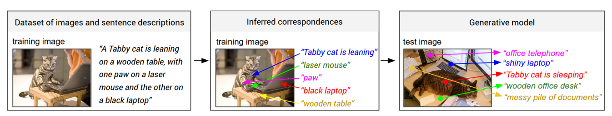

# Deep Learning - Image Captioning with Convolutional and Recurrent Neural Nets
========================================================================  

Author: Jonathan Kuo  
Version: 1.0  
Python: 3.6.1  
TensorFlow: 1.0.1
Keras: 2.0.4
  
Implementing convolutional and recurrent neural networks in Keras to generate sentence descriptions of images

### Introduction
--------------
The Keras deep learning architecture of this project was inspired by [Deep Visual-Semantic Alignments for Generating Image Descriptions](http://cs.stanford.edu/people/karpathy/cvpr2015.pdf) by Andrej Karpathy and Fei-Fei Li. 

  

Given input of a dataset of images and their sentence descriptions, define a Keras (TensorFlow backend) deep learning model that corresponds detected regions on image with description segments. This learning allows the model to output novel descriptions for test images.

### Dataset
--------------

  

Microsoft Common Objects in Context (MSCOCO) is an image recognition, segmentation, and captioning dataset. Training data includes 123,000 images and caption pairs. Validation and testing data are both 5,000 images and caption pairs. 

### Architecture   
--------------  
  
  

VGG16 CNN architecture (loaded in Keras) with pre-trained weights on ImageNet are used as the CNN to detect objects in the image. Then, the last dense softmax 200-classification layer was removed in order to pass the 4096-D activations into into the RNN (LSTM). CNN weights are frozen and RNN weights are updated in backpropagation through time (BPTT). The CNN and LSTM  is merged before passing into a second LSTM to predict the next word in the sequence. RMSprop is used as the optimizer to combat the vanishing gradient problem. 

### Demo
--------------  

View the demo iPython notebook for the model training and prediction on the MSCOCO dataset.
